#Use case and requirements for network information
This document outlines the use cases and requirements for an API that would give web applications access to network information. The use cases and requirements were gathered by looking at what both Websites, native platforms, and native applications do with such information.

## Motivation

The main questions this document seeks to explore are:

 * What are the motivations for making use of network information within an application?
 * What can an application do when it knows the kind of connection the user's device is using?
 * How does an application respond to the device switching from one kind of network connection to another?

##Web
The following are examples of web applications that use various means to detect if a user is on Wi-Fi or cellular.

### BBC News Website
When the user tries to watch a video on cellular, the [BBC News](http://bbc.com/news/) website warns the user that it might cost them money if they proceed.

When the site is accessed over Wi-Fi, the warning is not presented to users. Note that this is distinctly different from adaptive video streaming, which needs to happen both over Wi-Fi and cellular.

According to Jim Lay of the BBC:

> It's part of our GeoIP service to detect mobile gateways, which is then used - we show it on all devices tethered laptops as well as mobile ones, and the single shown on load message is okay for this - doesn't matter if the user is flip-flopping across a mobile and non-mobile connection during a session.
>
> It's possible that knowing during a page session that it's swapped between would be useful, as well as using it for the message we also use it for selecting appropriate quality media.

### GMail
When [GMail](http://gmail.com) is loading, it provides users with a link to "load basic HTML (for slow connections)" - which is a simplified/limited-yet-functional version of GMail.

##iOS
This section examines iOS 6 and 7, as well as various applications.

### Settings
Through iOS's settings application, iOS provides users with the ability to control which applications can communicate over cellular. In addition, the menu shows how much data each application has transferred over cellular.

As part of the settings application, iOS can tell a user that a system update is available. However, iOS does not allow the user to download the update unless they are connected to Wi-Fi. iOS will also pause system updates if the user loses the connection to a Wi-Fi network and automatically resumes downloads once the user reconnects to Wi-Fi.

Note that the buttons in the image are disabled - the download button serves both as a button and status indicator.

### Camera and photos
Through the settings of iOS's camera application, users have the ability to control if their photos are uploaded to Apple's [iCloud service](https://www.icloud.com/) when the device is connected to Wi-Fi. There is no option for photos to be uploaded automatically via cellular: if this option is turned off, iOS warns the users that photos in the photo stream will be deleted from the device.

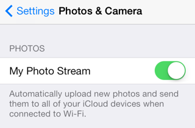

### Dropbox
The [Dropbox](https://itunes.apple.com/en/app/dropbox/id327630330) application allows users to select whether videos shot on the device should be automatically uploaded using cellular data.

### Spotify
The [Spotify](https://itunes.apple.com/en/app/spotify/id324684580) application allows users to select whether synchronization of audio tracks between devices can occur over cellular.

### Rdio
The [Rdio](https://itunes.apple.com/us/app/rdio/id335060889) application allows users to control both the quality of audio and synchronization over either Wi-Fi or cellular. The options available are "always" (cellular or Wi-Fi), "Wi-Fi only", or "never".

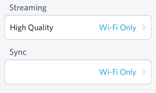

### NPR
The [NPR application](https://itunes.apple.com/en/app/npr-news/id324906251) on iOS claims to be able to detect when there is a "slow connection" - when it does so, it displays an alert box. It's not clear how it detects the bandwidth or what a "slow connection" is (could mean latency or raw download speed from their server?). It also seems to do this erroneously as the Wi-Fi connection is at full-strength - so the alert doesn't really help the user as there is nothing they can do to rectify the situation.

Even if bandwidth detection here was correct, notifying the user that "Content may be slow" is redundant to existing OS signals such as the radio signal strength, and to the fact that the user sees the content being downloaded slowly. Adding an alert notification that requires the user to click 'OK' is somewhat user hostile.

### AppStore Application
The AppStore does not allow users to download applications over 100Mbs unless they are on Wi-Fi.

Although the store will allow the user to purchase an application, it will queue the application for download for when the user next connects to Wi-Fi.

If the user transitions from Wi-Fi to cellular in the middle of a large download, iOS stops the download and warns the user.

### Audible
Audio books are generally around 50-100mb and come in individual pieces (which contain a range of book chapters). This means that an audio book can be on average about 100mb.

The [Audible](https://itunes.apple.com/us/app/audiobooks-from-audible/id379693831?mt=8) application on iOS won't let a user download audio books over cellular unless they explicitly set an option in the application's setting.

Even when set to allow downloading over the cellular network, audible lets the user know that they can disable this through the application's settings.

The Audible app will also detect when network connection switches from WI-FI to cellular and informs the user. When this happens, Audible will either continue the download on cellular automatically or halt the download.

Downloading large audio books takes significant time depending on bandwidth. It is often the case that a book is not fully downloaded before a user wants to listen (e.g., the user starts a download over Wi-Fi, but then leaves their house or closes the application).

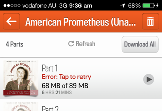

In such a case, it is possible to resume a download over cellular - but only if the user has explicitly allowed this in the application's settings. Note that this is controlled by the application, and not at the OS level. If the user has not allowed downloading over cellular, they get the option to enable this.

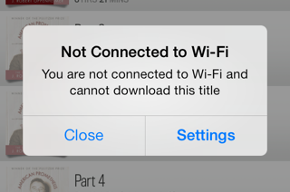

### Facebook
[Facebook](https://itunes.apple.com/en/app/facebook/id284882215?mt=8) application on iOS allows to control if videos should autoplay (or not) on cellular.

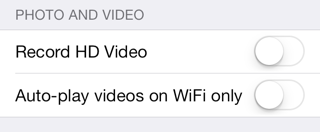

### Tweetbot
The [Tweetbot](http://tapbots.com/software/tweetbot/) application supports [streaming](https://dev.twitter.com/docs/streaming-apis), but only make use of it on Wi-Fi networks.

On cellular connections, the user has to manually pull-down to fetch new data and update the view.

User pulls down:

Any new content is loaded:

### iOS Messages application
If there's a data connection, then the Native iOS [messages application](https://www.apple.com/ios/messages/) uses the [iMessage cloud service](http://en.wikipedia.org/wiki/IMessage) to send the text message (rather than SMS), but over GPRS it usually always fails, and thus message isn't sent.

### ABC iview
The Australian Broadcasting Corporation's (ABC) [iview application on iOS](https://itunes.apple.com/au/app/abc-iview/id401778175) does not provide any settings for controlling which connection type should be used when consuming content. Instead, if the application detects a cellular connection, it pauses the download of content and displays a confirmation dialog that warns the user: "3G in use, charges may apply".

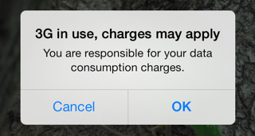

## Android
The following is a sample of native applications running on Android 4.x.

### Updates on Android
Android affords users the choice to select that applications should only be updated over Wi-Fi. It also allows updating at "any time" (meaning over cellular), but warns users that they may incur charges.

### Economist
The Economist application provides users with options for controlling which connection type is used to download new issues of the magazine.

In this case, new issues of the magazine will be auto-downloaded over cellular or Wi-Fi. Note that these options are unlike other applications in this sample, in that it explicitly lists "3G" instead of "cellular" or Wi-Fi. It is unclear if "3G" literally means a "3G" connection or if downloads will occur on other cellular connection types, such as GPRS or on more modern connection types the phone supports (e.g., "4G").

It must be noted that this option also appears on devices that don't support cellular connections (e.g., the Nexus 7 tablet). Showing the user options to synchronize items over a connection type that is not supported by the device can obviously be confusing.

### Google Play Store
[Google Play Store](https://play.google.com/store?hl=en) offers an option to download app updates only via Wi-Fi.

It also has settings to enable a warning before streaming over a mobile network and a setting to choose the preferred network for movie downloads.

### Google Play Music
[Google Play Music](https://play.google.com/store/apps/details?id=com.google.android.music&hl=en) allows the user to automatically cache and/or download the music only while on Wi-Fi. It also offers the settings to adjust the quality of the music stream and to forbid it while on a mobile connection.

### Netflix
Netflix affords users the choice to restrict video playback to Wi-Fi only.

### Facebook
Just as with iOS, Facebook gives the user the choice to only auto-play videos when connected to Wi-Fi.

### Evernote
The Evernote application affords users the choice to only sync when connected to a Wi-Fi network.

### Pocket
The Pocket application gives users control as to whether downloads should occur exclusively over Wi-Fi.

### YouTube
The [YouTube](https://play.google.com/store/apps/details?id=com.google.android.youtube&hl=en) application on Android offers the possibility of prefetching videos in advance while on Wi-Fi and the device's battery is charging.

### Spotify
Same as for iOS, [Spotify](https://play.google.com/store/apps/details?id=com.spotify.mobile.android.ui) on Android has a setting to allow downloads over the mobile network.

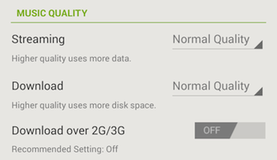

### Gmail and Mail
[Gmail for Android](https://play.google.com/store/apps/details?id=com.google.android.gm&hl=en) offers a setting to download attachments only via Wi-Fi.

The same option appears in Android's mail application.

### Google+

The Google+ application allows the user to backup photos and videos taken with their device, and gives them network options for these tasks. The user can tell the application to only backup photos or videos on a WiFi connection, not to backup when roaming, or whether to force a backup. They also offer an “About Auto-Backup” section to offer the user more information about this feature.

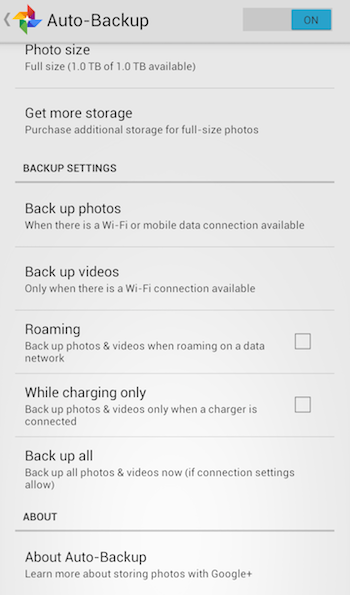

### Google Play Books

The Google Play Books application allows the user to choose whether they automatically update the app only on WiFi. Also users can “pin” books for use in offline mode, this will force the app to fully download the book (not just download per the chapter a user is reading) so the user can read the book while offline. If the user clicks the pin again the user will receive a message to ask them whether they accept that they will not be able to read the book unless they are connected to the internet.

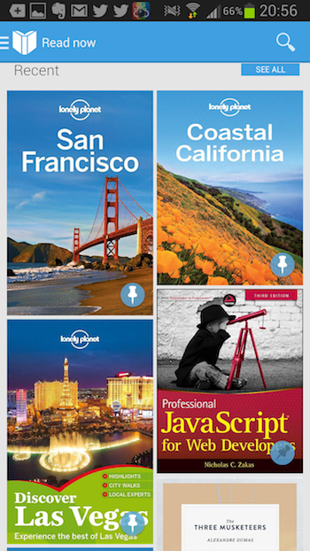
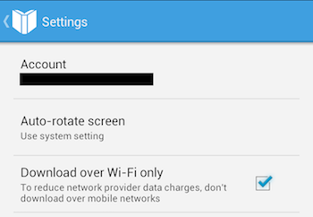

###Player FM

The Player FM application allows the user to choose which network type they wish to download episodes on, which network to auto-download episodes on and how many episodes to auto-download.  The application will also allow the user to cut all network activity ("Force offline").

### WhatsApp

The WhatsApp application allows the user to choose what media to download on the mobile network, when connected to Wi-Fi, and when roaming.

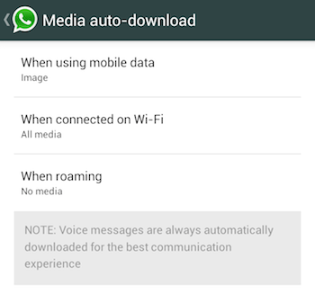

### Others

Many other android applications offer the user the ability to turn off downloads when not on WiFi, these include: Amazon MP3, Chrome browser, Google Drive, Dropbox, Firefox, Flipboard, Google Play Movies, Google Play Newstand, TED.

## Windows Phone
Windows Phone provides users with the option to allow mobile data to be used in the event of limited Wi-Fi connectivity. When this option is changed to "use mobile data", the phone informs the user that "your phone will use mobile data when Wi-Fi connectivity is limited. This will use your data plan and may incur a charge". It's unclear what "connectivity is limited" means.

In addition, Windows Phone 8 includes a "data sense" feature that claims to "find more efficient ways to use mobile data and display your usage. For example, some data will download only when you are connected to Wi-Fi". The feature allows the user to set a download limit for cellular connections and will notify the user when that limit is exceeded.

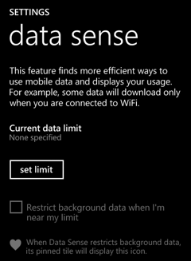

### Photos and videos
Windows phone 8 allows users to control whether photos are synchronized over Wi-Fi and/or cellular. Window Phones 8 restricts what can be sent over which connection type. For example, "good quality" photos can be sent over cellular, but "best quality" photos can only be send over Wi-Fi. Videos, irrespective of quality, can only be synchronized over Wi-Fi or not at all.

## Use cases and Requirements

From the applications listed above, the recurring use cases appear to be:

* Warning the user that doing something over cellular could cost them money.
* Detecting when a connection switches from cellular to Wi-Fi, and vice versa.
* Giving the user control as to whether large uploads/downloads should happen over cellular (mostly related to synchronizing media data like photos, videos, and audio files).
* Preventing accidental data transfer over cellular, which could use up the user's data transfer quota and/or cost them money.

In order to be able to replicate the functionality seen in native applications, the requirements for the web platform appear to be:

 * provide access to the connection type the system is using to receive data: namely cellular, Wi-Fi, or none (e.g., airplane mode). This information needs to be available either immediately on page load or as close as possible to it. If the connection type changes, then the change needs to be reflected in the API in a way that script can access the updated information.

 * provide a means for scripts to be notified if the connection type changes. This is to allow developers to make dynamic changes to the DOM and/or inform the user that the network connection type has changed (and that it could impact them in some way).

## Discussion
TBW...

### Managing downloads
When starting a large download, one ought to ask whether replicating the native use cases ought to be done by the app directly or through some mediation via the browser. For instance, a [download manager](http://en.wikipedia.org/wiki/Download_manager) might be more effective for the "large download" use case: instead of developers having to manage downloads by inspecting the type of connection, a download manager could queue downloads until a certain connection type is available - plus provide the user with additional settings and options to pause/resume/cancel downloads, etc. A download manager could also take the form of an API that allows for file tranfers in the background. Scripts could then queue file transfers, and the user agent could then choose to transfer files when it sees fit: optimizing not only for network conditions, but also for battery and CPU usage (e.g. upload files when on Wi-Fi, plugged in, and with low CPU activity).

Having said that, in-application downloads are very application specific (e.g., as in audio books for the Audible application which can be played as they download, or audio tracks for Spotify). So, while a the download manager would probably help with managing connection type, error recovery, and pausing/resuming/cancelling, the download process still needs to provide feedback (progress and errors) to the application irrespective of connection type.

Additionally, given the reactive nature of content synchronization, having a global download manager may be difficult for user's to manage - as setting options for the download manager might override options in all applications. For example, a user may want to be able to download audio books on cellular ("cost/quota be damned!") but does not want to accidentally kick off a bunch of other synchronization tasks. In MacOS, for instance, this unwanted behavior can happen when the user tethers with a mobile device: as tethering simply acts like a Wi-Fi connection, a system-wide network availability event is sent out causing applications to start synchronizing. This can result in large amounts of data being transferred in the background unless the user intervenes by shutting down applications manually (e.g., email programs, Dropbox, etc.).

## License
 To the extent possible under law, the [contributors](https://github.com/w3c-webmob/netinfo/graphs/contributors) have waived all copyright and related or neighboring rights to this work. In addition, as of 21 December 2013, the editors have made this document available under the Open Web Foundation Agreement Version 1.0, which is available at http://www.openwebfoundation.org/legal/the-owf-1-0-agreements/owfa-1-0.

Parts of this work may be from an existing document. If so, those parts are instead covered by the license of the existing document document.

Screenshots used in this work are from copyrighted software applications. Their use in this document fall under [fair use](http://en.wikipedia.org/wiki/Fair_use).

## Acknowledgments
See the [list of contributors on GitHub](https://github.com/w3c-webmob/netinfo/graphs/contributors) to see who authored this document.

Huge thanks to Yoav Weiss, Mathias Bynens, Tobie Langel, Michael Hung fo, Jim Ley, Fernando Jiménez Moreno, Nicolas Perriault, Joe Crawford, Shane Hudson, Roland Warmerdam, Remy Sharp, Andrew Overholt and Salvador de la Puente.
